  

### Con qué trabajo

  
  
  
  
  
  
  
  

### Proyecto destacado

### Algunos números

  
  

### Contacto

Si querés charlar sobre el proyecto o sobre datos abiertos en Uruguay, escribime:

  
  

